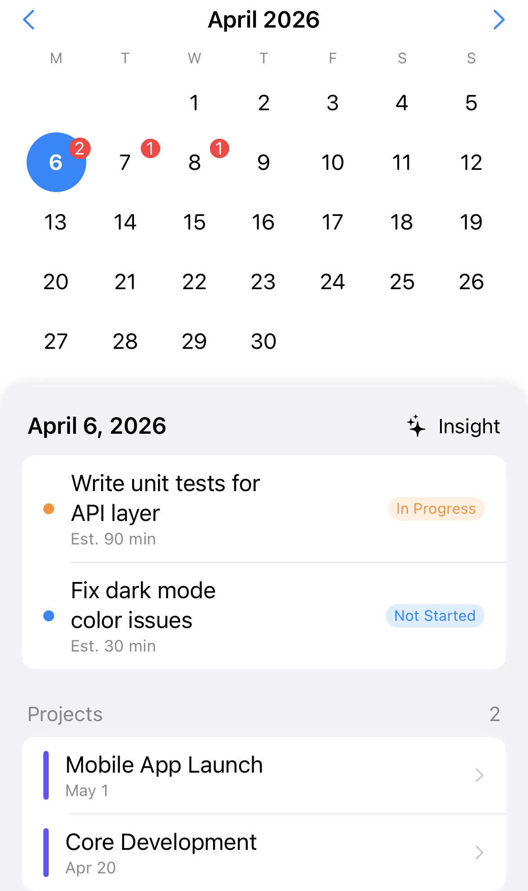
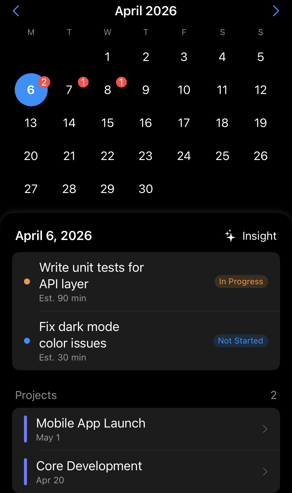
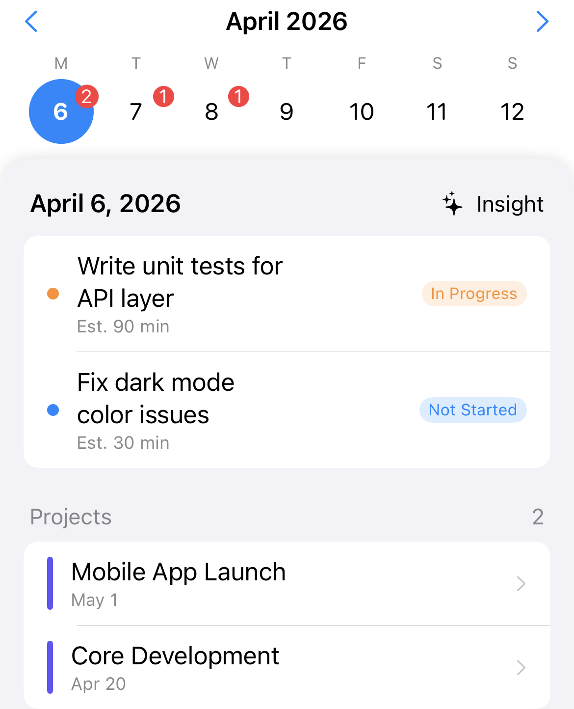
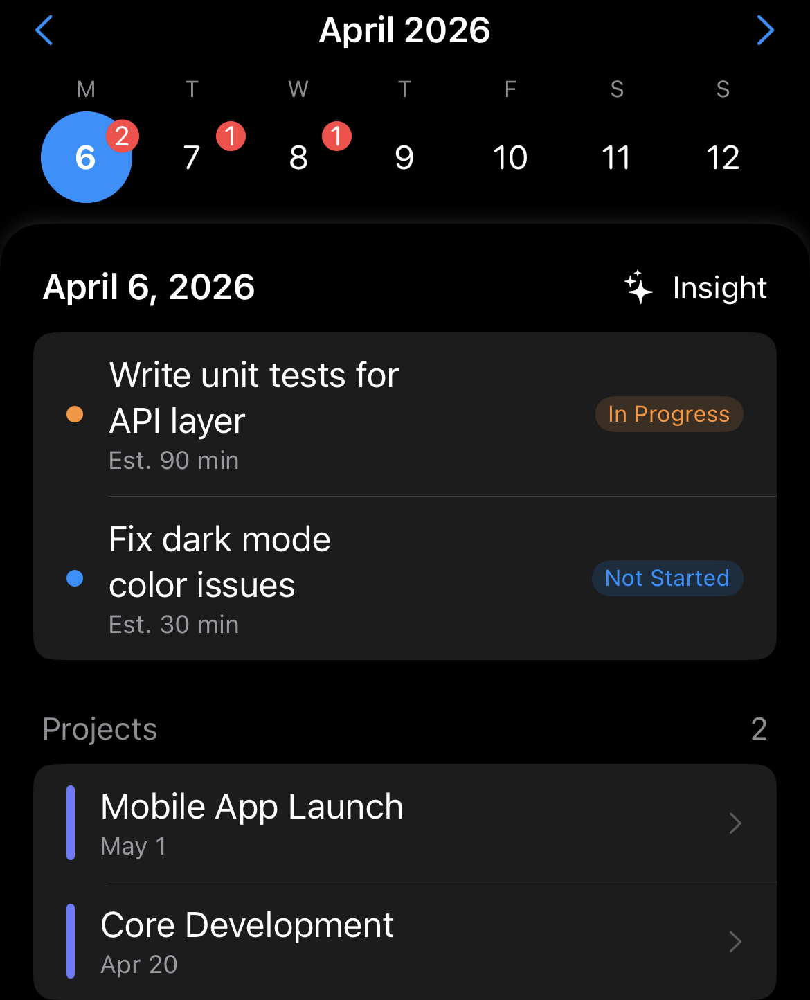
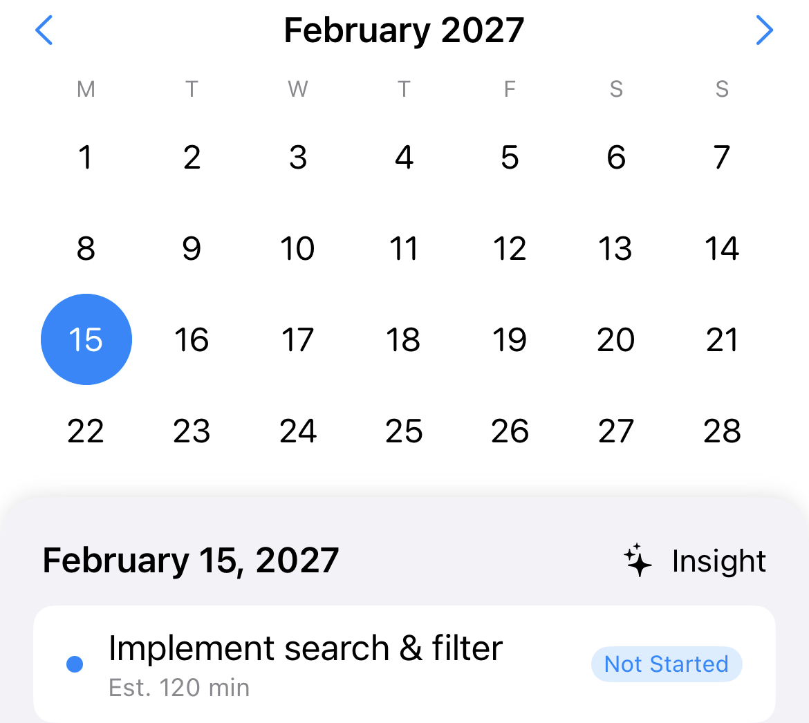
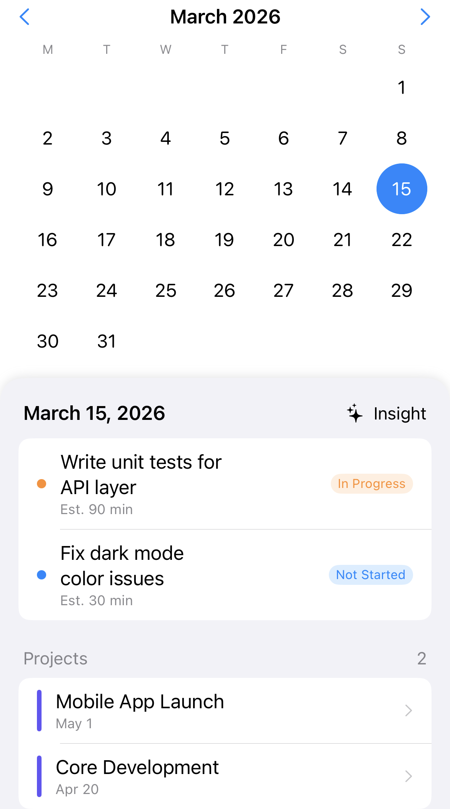
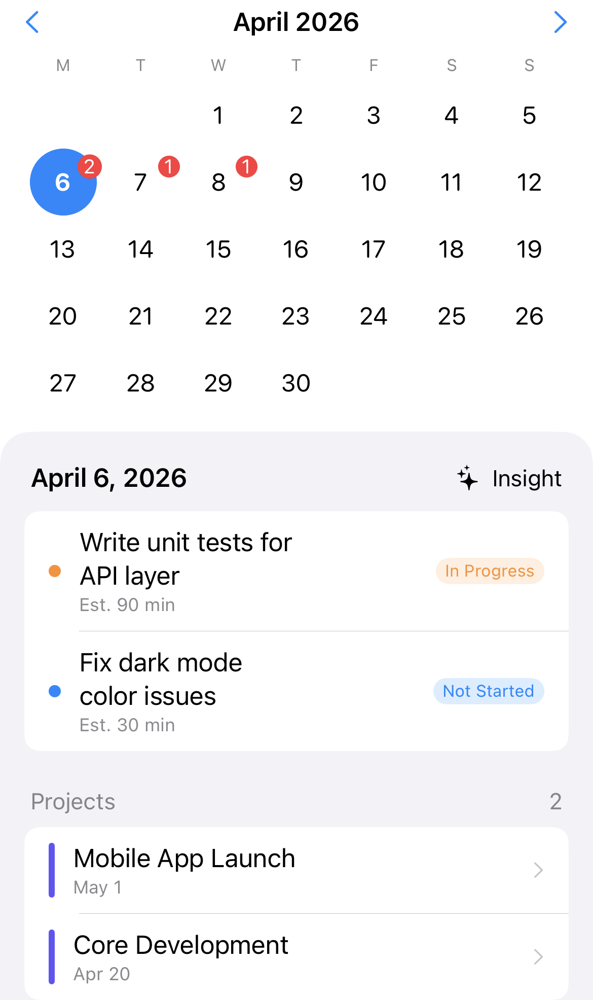
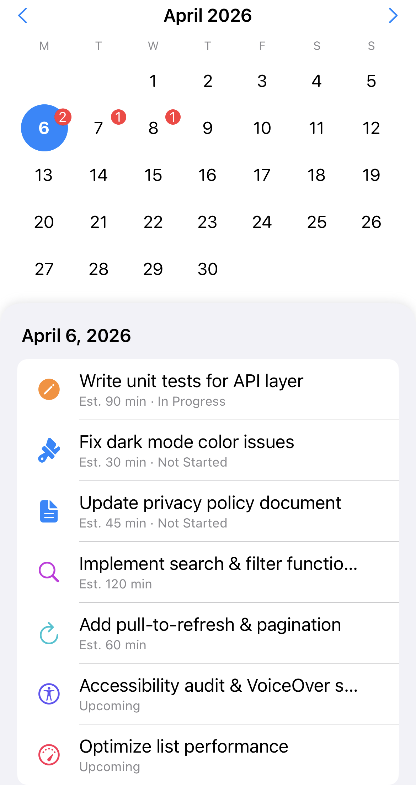

# MBExpandableCalendar

[中文](README.zh-CN.md)

A SwiftUI calendar component that smoothly collapses from **month view** to **week view** via drag gesture, with horizontal paging and badge support.

## Screenshots

| Screenshots | Description |
|:---:|---|
|   | **Month View** — Full month grid with per-date badge counts. Adapts to 4–6 row months. Supports light and dark mode. |
|   | **Week View (Collapsed)** — Collapses to a single-week strip via drag gesture. Spring-animated, rubber-band overscroll feel. |
|   | **Variable Row Count** — 4-row vs 6-row months. The calendar height animates smoothly as the month changes. |
|   | **Content Styling** — The content area below the calendar is fully composable. Left: flat edge-to-edge style. Right: rounded card with no shadow. |
|  | **Custom Content** — Bring your own list. Any SwiftUI view works as the scrollable content area beneath the calendar. |

## Features

- **Month ↔ Week collapse** — drag-driven, spring-animated transition between full month grid and single-week strip
- **Horizontal paging** — swipe left/right to navigate months with crossfade transition
- **Badge counts** — per-date badge overlay (top-right corner)
- **Rubber-band overscroll** — elastic feel when dragging past collapse bounds
- **Scroll-linked gesture** — collapse only triggers when the content scroll view is at top
- **Zero dependencies** — pure SwiftUI, no external packages

## Requirements

- iOS 17.0+
- Swift 6.0+
- Xcode 16+

## Installation

Add as a local Swift Package in Xcode:

1. File → Add Package Dependencies → Add Local...
2. Select the `MBExpandableCalendar` directory

Or in `Package.swift`:

```swift
.package(path: "../MBExpandableCalendar")
```

## Usage

### ExpandableCalendarContainer (recommended)

The full-featured container: calendar on top, your scrollable content below, with built-in collapse gesture.

```swift
import MBExpandableCalendar

struct CalendarScreen: View {
    @State private var selectedDate = Date()

    var body: some View {
        ExpandableCalendarContainer(
            selectedDate: $selectedDate,
            badgeCount: { date in
                // Return badge count for each date
                Calendar.current.isDateInToday(date) ? 3 : 0
            }
        ) { selectedDate, listAtTop in
            List {
                // Your content here
                Text("Selected: \(selectedDate, format: .dateTime.month().day())")
            }
            .onScrollGeometryChange(for: Bool.self) { geo in
                geo.contentOffset.y <= geo.contentInsets.top + 1
            } action: { _, atTop in
                listAtTop.wrappedValue = atTop
            }
        }
    }
}
```

> **Important:** The content closure must update the `listAtTop` binding via `.onScrollGeometryChange` (or equivalent) so the container knows when to enable the collapse gesture.

### CompactCalendarView (standalone)

Use the calendar grid alone when you need custom gesture or layout control:

```swift
import MBExpandableCalendar

CompactCalendarView(
    selectedDate: $date,
    badgeCount: { _ in 0 },
    collapse: collapseValue,           // 0 = month, 1 = week
    isDraggingVertically: isDragging,
    suppressTap: suppress
)
```

## API

### CompactCalendarView

| Parameter | Type | Default | Description |
|-----------|------|---------|-------------|
| `selectedDate` | `Binding<Date>` | — | Currently selected date |
| `badgeCount` | `(Date) -> Int` | — | Badge count for each date |
| `overscaleAnchor` | `UnitPoint` | `.center` | Anchor for rubber-band scale effect |
| `collapse` | `CGFloat` | `0` | Collapse progress: 0 = month, 1 = week |
| `isDraggingVertically` | `Bool` | `false` | Disables horizontal paging during vertical drag |
| `suppressTap` | `Bool` | `false` | Prevents date taps during drag |

### ExpandableCalendarContainer

| Parameter | Type | Description |
|-----------|------|-------------|
| `selectedDate` | `Binding<Date>` | Currently selected date |
| `badgeCount` | `(Date) -> Int` | Badge count for each date |
| `content` | `(Date, Binding<Bool>) -> Content` | Scrollable content below the calendar |

## License

MIT
